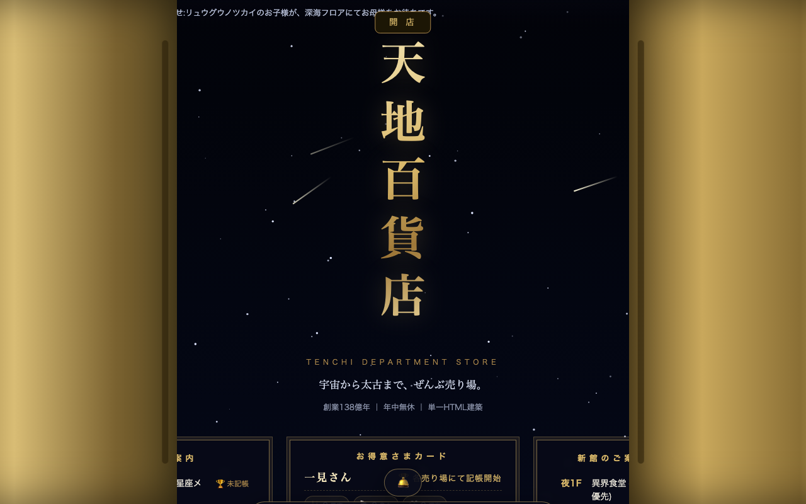

# 🏬 天地百貨店 — TENCHI DEPARTMENT STORE

> **宇宙から太古まで、ぜんぶ売り場。** 創業138億年。


-red)


ブラウザで遊べるトイゲーム **9店舗** が入居する、縦型デパートです。
入口 [`index.html`](index.html) をスクロールすると、**屋上（宇宙）から地下5階（太古の地層）、その下のマントルまで** エレベーターなしでも降りられます。1階は波の都合により改装中です。

全店舗 **1ゲーム＝1枚のHTML**。ビルドなし、フレームワークなし、外部アセットなし。
グラフィックはCanvas手描き、音楽はその場で自動作曲、名前や歴史はぜんぶプロシージャル生成でございます。

---

## 開店方法

```bash
git clone https://github.com/airuky/Tenchi-Department-Store.git
cd Tenchi-Department-Store
python3 -m http.server 8741
# → http://localhost:8741/ で開店
```

`index.html` をダブルクリックするだけでも開店しますが、
お魚のお持ち帰り（Picture-in-Picture）や外商部（WebRTC）など一部のサービスは
HTTPサーバー経由・Chrome系ブラウザでのご利用をおすすめいたします。

---

## フロアガイド（本館）

| フロア | 売り場 | 店舗 | 取扱商品 |
|---|---|---|---|
| **R 屋上** | 星空遊園地 | [星座メーカー](constellation-maker/index.html) | 恒星（量り売り）・神話（後付け）・流れ星（投げ放題） |
| **2F** | 島づくり用品 | [架空の島メーカー](island-maker/index.html) | 島（架空）・地名（自動生成）・火山（よく噴火） |
| **1F** | 海面フロア | — | 改装中（波の都合） |
| **B1F** | デパ深海 | [深海水族館](deep-sea-aquarium/index.html) | 光る魚・マリンスノー・水圧（無料） |
| **B5F** | 考古・文明売り場 | [文明の年代記](chronicle/index.html) | 文明（諸行無常）・歴史（年表付き）・滅亡（おまけ） |
| **マントル階** | — | — | 関係者（マグマ）以外立入禁止 |

## 新館のご案内（ANNEX）

本館入口の「新館のご案内」よりお越しいただけます。

| 案内 | 店舗 | ひとこと |
|---|---|---|
| **夜1F** | [異界食堂](ikai-shokudo/index.html) | 夜にだけ開く食堂（常連様優先） |
| **駅** | [終電後の駅](eki/index.html) | 地下連絡通路の先。終電は出ました |
| **別2F** | [おばけ長屋の大家さん](nagaya/index.html) | 店子募集中（妖怪可） |
| **夜勤** | [百貨店の夜警](yakei/index.html) | 当館の夜のすがた（求人） |
| **庭** | [苔庭と砂紋](koke-niwa/index.html) | 屋上庭園別亭・心の静けさ完備 |

---

## 館内設備（本館入口）

- 🛗 **エレベーター** — 「上へまいります」音声案内つき。ゲームパッドの十字キーにも対応しております（なぜ?）
- 📮 **全館スタンプラリー** — 各フロアご滞在で押印。全制覇で粗品（称号・現物支給なし）。裏スタンプもございます
- 🧺 **お買い物カゴ＆レシートプリンター** — 各売り場の試供品（¥0）をレジへ。レシートはPNG保存可、約5000年で化石になります
- 🎶 **館内BGM** — Web Audioがその場で作曲する有線風。**3分放置すると蛍の光が流れます**が、閉店はいたしません
- 🏃 **非常口（下り専用・物理演算）** — 屋上から飛び降りて太古まで直行。海面通過時に波に怒られます
- ☎ **外商部** — WebRTC手動シグナリングでお友達を召喚。招待状はLINE・メール・伝書鳩でお運びください
- 🐟 **お魚のお持ち帰り** — チョウチンアンコウを小窓（Picture-in-Picture）に包装。他のタブにも付いてきます。返却不要
- 👻 **他タブのお客様** — 別タブで開くと、館内断面図にお客様（🦑👽など）がご来店なさいます
- 🎡 **宇宙観覧車** — 真空対応。真空のほうが軽快に回ると本人が申しております
- 🕹 **隠しコマンド** — ↑↑↓↓←→←→BA で全館大開店セール（全品0円。もともと0円）

<!-- 外観写真をここに（docs/ にスクリーンショットを置いて差し込んでください）

-->

---

## 技術力の無駄遣い一覧

| 技術 | 当店での使途 |
|---|---|
| Canvas 2D | 宇宙〜マントルの縦長世界、観覧車、レシート印刷、全店舗の絵 |
| Web Audio API | 館内BGM自動作曲・蛍の光・ピンポン音・深度連動の環境音・風切り音 |
| SpeechSynthesis | エレベーターガール（研修済み） |
| WebRTC DataChannel | サーバーレスお友達召喚（SDPを手動でお運びいただく方式） |
| BroadcastChannel | 別タブのお客様のご来店案内 |
| Document Picture-in-Picture | お魚のお持ち帰り |
| Gamepad API | エレベーター（なぜ?） |
| SVG feTurbulence | 深海売り場の水中ゆらぎ・マントル階の陽炎 |
| Vibration API | 非常口ご利用時の着地の衝撃 |
| Battery Status API | お客様の端末の電池残量表示（当店は責任を負いかねます） |
| localStorage | スタンプ台紙・来店者数・音声設定のお預かり |
| プラグインAPI | 各店舗に `window.SEA` / `ISLE` / `REKISHI` 等を常設。増築は `<script>` 1枚から |

---

## お客様の声

> 「文明を購入したら、帰り道で滅亡しました」（地下5階・歴史好きさん）
> — 店長より「仕様でございます。次の文明のご入荷をお待ちくださいませ」

> 「観覧車が真空で回っていて、心配です」（高所恐怖症さん）
> — 店長より「真空のほうが軽快に回ると、観覧車本人が申しております」

> 「全品0円で、逆に申し訳なくなりました」（律儀なお客様）
> — 店長より「お気持ちは全額ポイントに加算させていただいております」

---

## 営業案内

| | |
|---|---|
| 営業時間 | ビッグバン 〜 宇宙の熱的死 |
| 定休日 | ございません |
| 売場面積 | 約5.1億km²（地表換算） |
| お問い合わせ | 星に願いを |
| 設計・施工 | [airuky](https://github.com/airuky) × Claude（機械学習製の大工） |

## のれん分け（License）

[MIT](LICENSE) でございます。複製・改装・のれん分け、ご自由にどうぞ。
なお、文明の滅亡・タコの脱走・観覧車の回転不良・蛍の光による誤閉店につきまして、当店は一切の責任を負いかねます。

**本日もご来店、誠にありがとうございます。**
